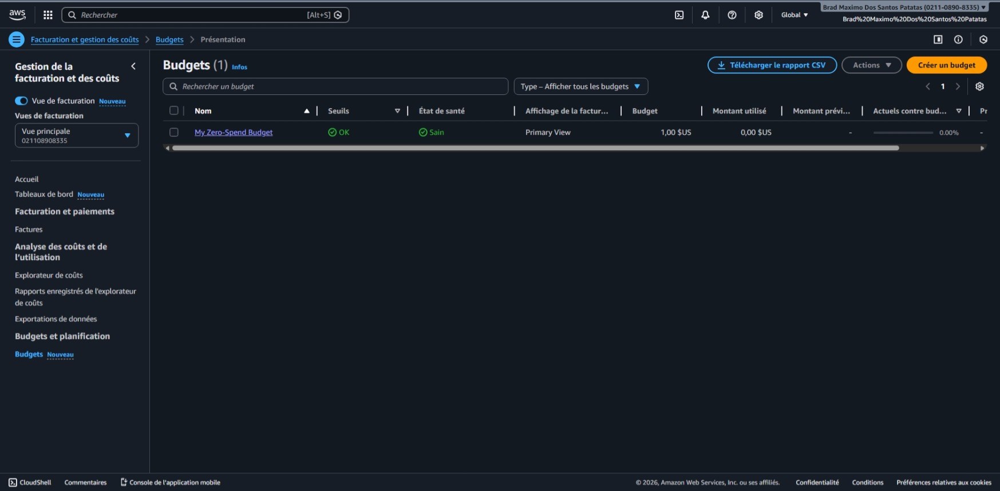

# TP1 AWS — Events API (Serverless)

Ce dépôt contient une API REST “Events” (CRUD) déployée sur AWS en architecture serverless, conforme au cahier des
charges du TP :  
API Gateway (**HTTP API**) → **AWS Lambda** (Node.js 22 / TypeScript) → **DynamoDB** + upload d’images via **URL
présignée S3**, avec contraintes “anti-facture” (Free Tier).

Livrables attendus (résumé) :

- Code des Lambdas + `template.yml` (SAM) + tests (≥ 5) + `README.md` (setup + endpoints + coûts + sécurité)
- Preuve de déploiement : URL API Gateway + exemples de requêtes
- Sécurité : IAM least privilege + S3 (Block Public Access + SSE-S3)
- Exploitation : logs lisibles + rétention 3–7 jours + budget/alertes (preuves)

---

## 0) Architecture

- Client (Postman / cURL / PowerShell)
- API Gateway HTTP API (v2, stage `$default`)
- Lambda (1 handler “router”)
- DynamoDB (table Events, mode provisionné)
- S3 (bucket images, upload **uniquement** via URL présignée)
- CloudWatch Logs (logs JSON + rétention)

---

## 1) Pré-requis

### Outils

- AWS CLI (configuré)
- AWS SAM CLI
- Node.js 22 + npm
- Git

### Vérifications (PowerShell)

```powershell
aws sts get-caller-identity
sam --version
node -v
```

Si `aws sts get-caller-identity` échoue : exécuter `aws configure` (Access Key / Secret / Region / Output).

---

## 2) Garde-fous coût (obligatoire)

But : rester dans le Free Tier + éviter une facture (log retention, pas de VPC/NAT, etc.).

### 2.1 Activer les alertes Free Tier

Console AWS → **Billing** → **Billing preferences** → activer **Free Tier alerts** (email).

### 2.2 Créer un budget mensuel 0–1€

Console AWS → **AWS Budgets** → Create budget → **Cost budget** → Monthly → montant **1€** (ou 1$) → alerte email (ex:
80% + 100%).

Preuves (captures d'écrans) :

- 


- 

---

## 3) Installation du projet

```powershell
git clone https://github.com/afthegamer/tp-aws
cd tp-aws
npm i
```

Notes Windows :

- Le build SAM peut rencontrer des soucis de chemins trop longs/symlinks. Le contournement propre :

```powershell
subst X: "C:\chemin\vers\tp-aws"
X:
cd X:\tp-aws
```

---

## 4) Infra (SAM) — template.yml

### 4.1 Ressources principales

- `AWS::Serverless::HttpApi` (HTTP API) avec CORS
- `AWS::DynamoDB::Table` (PROVISIONED, 1 RCU / 1 WCU, clé `pk`)
- `AWS::S3::Bucket` (SSE-S3 AES256 + Block Public Access + CORS S3)
- `AWS::Serverless::Function` (HelloWorldFunction) + routes HTTP API
- `AWS::Logs::LogGroup` (rétention 7 jours)

### 4.2 Variables d’environnement

La Lambda utilise :

- `EVENTS_TABLE` : nom/ARN logique de la table DynamoDB
- `EVENTS_BUCKET` : bucket S3 images

### 4.3 Sécurité (template)

- DynamoDB en PROVISIONED (≤ 25 RCU/WCU, ici 1/1)
- S3 : chiffrement **SSE-S3** (AES256), Block Public Access, pas d’objets publics
- IAM : permissions limitées à la table/bucket ciblés (SAM policies paramétrées)

### 4.4 Rétention CloudWatch Logs (dans SAM)

Le cahier des charges exige 3 à 7 jours. On fixe 7 jours.

Exemple de ressource (dans `Resources:`) :

```yaml
HelloWorldFunctionLogGroup:
        Type: AWS::Logs::LogGroup
        Properties:
                LogGroupName: !Sub "/aws/lambda/${HelloWorldFunction}"
                RetentionInDays: 7
```

---

## 5) Build & Deploy (procédure “sans surprise”)

Important : sous Windows, pour éviter des bugs (ex: “Cannot find module 'app'”), on déploie **le template buildé**.

```powershell
sam validate

sam build --no-cached -t .\template.yml

sam deploy `
  --template-file .\.aws-sam\build\template.yml `
  --stack-name tp-aws `
  --region eu-west-3 `
  --capabilities CAPABILITY_IAM `
  --resolve-s3 `
  --confirm-changeset
```

### 5.1 Récupérer les outputs (URLs, bucket…)

Après le deploy, SAM affiche les outputs. On peux aussi les relire :

```powershell
aws cloudformation describe-stacks `
  --stack-name tp-aws `
  --region eu-west-3 `
  --query "Stacks[0].Outputs" `
  --output table
```

---

## 6) Endpoints (cahier des charges)

Base URL :

- `https://z7sn1zzeth.execute-api.eu-west-3.amazonaws.com`

Endpoints minimum :

1. `POST /events`
2. `GET /events`
3. `GET /events/{id}`
4. `PUT /events/{id}`
5. `DELETE /events/{id}`
6. `POST /events/{id}/upload-url`

Exemples d'URLs complètes :

- `GET https://z7sn1zzeth.execute-api.eu-west-3.amazonaws.com/hello`
- `POST https://z7sn1zzeth.execute-api.eu-west-3.amazonaws.com/events`
- `GET https://z7sn1zzeth.execute-api.eu-west-3.amazonaws.com/events`
- `GET https://z7sn1zzeth.execute-api.eu-west-3.amazonaws.com/events/{eventId}`
- `PUT https://z7sn1zzeth.execute-api.eu-west-3.amazonaws.com/events/{eventId}`
- `DELETE https://z7sn1zzeth.execute-api.eu-west-3.amazonaws.com/events/{eventId}`
- `POST https://z7sn1zzeth.execute-api.eu-west-3.amazonaws.com/events/{eventId}/upload-url`

---

## 7) Modèle “Event”

Champs :

- `eventId` (UUID)
- `title` (string, obligatoire, max 200)
- `date` (ISO 8601, obligatoire, ex: `YYYY-MM-DD`)
- `location` (string, optionnel, max 200)
- `description` (string, optionnel, max 2000)
- `imageKey` (string, optionnel — clé S3)
- `createdAt` (ISO timestamp)
- `updatedAt` (ISO timestamp)

Stockage DynamoDB :

- Partition key : `pk`
- Convention : `pk = "EVENT#<uuid>"`

---

## 8) Validation & erreurs HTTP

Validation (exigée) :

- `title` obligatoire + taille max
- `date` obligatoire + format ISO strict
- tailles max sur `location`, `description`
- rejeter payloads non-JSON ou champs de mauvais types

Codes :

- `400` : validation / payload invalide
- `404` : event introuvable
- `500` : erreur interne

---

## 9) Upload image via URL présignée S3

Flux :

1) Le client crée l’event (`POST /events`)
2) Le client demande une URL présignée (`POST /events/{id}/upload-url`)
3) Le client fait un **PUT direct vers S3** sur l’URL présignée
4) L’API stocke `imageKey` sur l’event

Caractéristiques :

- URL présignée limitée : **300s**
- Upload **non public**
- Bucket chiffré SSE-S3

---

## 10) Tests (PowerShell) — procédure complète

Définir la base (remplace par ta vraie URL) :

```powershell
$base = "https://z7sn1zzeth.execute-api.eu-west-3.amazonaws.com"
```

### 10.1 Create (date obligatoire)

```powershell
$ev = Invoke-RestMethod -Method Post -Uri "$base/events" -ContentType "application/json" `
  -Body (@{ title="Event spec"; date="2026-01-27"; location="Lyon"; description="Desc" } | ConvertTo-Json)

$eventId = $ev.eventId
```

### 10.2 List / Get

```powershell
Invoke-RestMethod "$base/events"
Invoke-RestMethod "$base/events/$eventId"
```

### 10.3 Update (PUT partiel)

```powershell
Invoke-RestMethod -Method Put -Uri "$base/events/$eventId" -ContentType "application/json" `
  -Body (@{ title="Event spec (updated)" } | ConvertTo-Json)
```

### 10.4 Générer URL présignée (endpoint exact)

```powershell
$up = Invoke-RestMethod -Method Post -Uri "$base/events/$eventId/upload-url" -ContentType "application/json" `
  -Body (@{ contentType="image/jpeg" } | ConvertTo-Json)
```

### 10.5 Upload vers S3 (PUT)

```powershell
$file = "C:\chemin\vers\image.jpg"
Invoke-WebRequest -Method Put -Uri $up.uploadUrl -InFile $file -ContentType "image/jpeg" | Select-Object StatusCode
```

Attendu : `StatusCode 200`.

### 10.6 Delete

```powershell
Invoke-WebRequest -Method Delete -Uri "$base/events/$eventId" | Select-Object StatusCode
```

Attendu : `StatusCode 204`.

---

## 11) Observabilité (logs JSON + rétention)

### 11.1 Logs structurés JSON

Le handler log en JSON avec au minimum :

- `requestId`, `method`, `path`, `routeKey`, `statusCode`, `durationMs`
- en erreur : `errorName`, `errorMessage`, `errorStack` (en logs seulement)

Lire les logs en live :

```powershell
sam logs -n HelloWorldFunction --stack-name tp-aws --region eu-west-3 --tail
```

### 11.2 Vérifier la rétention CloudWatch

Si la rétention est appliquée via IaC, elle doit être déjà à 7. Sinon, on peux la forcer via CLI :

```powershell
aws logs put-retention-policy `
  --region eu-west-3 `
  --log-group-name "/aws/lambda/<nom-de-ta-lambda>" `
  --retention-in-days 7
```

Vérifier :

```powershell
aws logs describe-log-groups `
  --region eu-west-3 `
  --log-group-name-prefix "/aws/lambda/tp-aws-HelloWorldFunction" `
  --query "logGroups[0].retentionInDays" `
  --output text
```

Attendu : `7`.

---

## 12) Tests unitaires (≥ 5)

Les tests sont dans `hello-world/` (Vitest).

```powershell
cd .\hello-world
npm test
```

Exemples de choses testées :

- `isValidIso8601` accepte `YYYY-MM-DD` et rejette les formats non ISO
- normalisation de chaînes (trim + types)
- validation des longueurs max

---

## 13) Sécurité

### IAM (least privilege)

- La Lambda a un rôle IAM dédié (créé par SAM)
- Droits DynamoDB/S3 limités à la table et au bucket de la stack (pas de `*` global)

### S3

- Block Public Access : activé
- SSE-S3 (AES256), pas de KMS
- upload uniquement via URL présignée

### Secrets

- aucun secret en dur
- uniquement variables d’environnement (TABLE / BUCKET)

---

## 14) Dépannage (les pièges possible)

### 14.1 Windows + curl + JSON

Sous Windows, `curl` dans PowerShell peut créer des problèmes de quoting. Utilise `Invoke-RestMethod` +
`ConvertTo-Json` (comme dans ce README).

### 14.2 “Symbolic link creation failed” pendant `sam build`

Ce n’est pas bloquant : SAM “copie” au lieu de symlinker. Pour éviter les erreurs de chemins, utiliser `subst X:`.

### 14.3 “Template file not found … template.yml”

Le fichier du dépôt s’appelle `template.yml`. Toujours préciser :

```powershell
sam build -t .\template.yml
```

### 14.4 “Cannot find module 'app'” en Lambda

Cause typique : déploiement du mauvais template / mauvais package. Solution :

- `sam build`
- déployer **le template buildé** : `--template-file .\.aws-sam\build\template.yml`

---

## 15) Nettoyage (suppression complète)

1) Vider le bucket (si des fichiers existent) :

```powershell
aws s3 rm "s3://<EventsBucketName>" --recursive
```

2) Supprimer la stack :

```powershell
sam delete --stack-name tp-aws --region eu-west-3
```

---

## 18) Résultats de mon déploiement (à remplir)

- Région : `eu-west-3`
- Stack : `tp-aws-events`
- Base URL : `https://z7sn1zzeth.execute-api.eu-west-3.amazonaws.com`
- Bucket S3 : `tp-aws-events-eventsbucket-tauwuivuuy4m`
